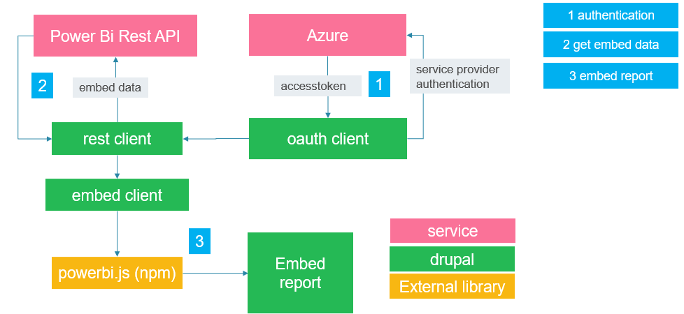

# Power BI Integration

Provides tools to integrate PowerBi into Drupal

## INTRODUCTION

These modules provide the tools to integrate PowerBi into Drupal, with
the different modules you will be able to access the embed and RestAPI
of PowerBi.
This is the process workflow and the role of each of the modules in it:


The functionality is provided by three components:
- Authentication:
    - The plugins PwbiServicePrincipal and ServicePrincipal provide
authentication to Power Bi
- REST API service:
    - Provided by pwbi_api module
- Media Type:
    - Provided by pwbi_embed, allows creating media types to manage embedded
objects

## REQUIREMENTS

- [OAuth2 Client] https://www.drupal.org/project/oauth2_client
- [powerbi-client] https://github.com/microsoft/PowerBI-JavaScript.

## INSTALLATION

Install as you would normally install a contributed Drupal module. For further
information, see
[Installing Drupal Modules](https://www.drupal.org/docs/extending-drupal/installing-drupal-modules).

To install the Power Bi javascript library (powerbi-client) use one of these
methods:

### PREFERRED METHOD:
PowerBi Embed provides a package.json to include the
powerbi-client library. Make sure you have NPM of Node.js
installed in your system and from the module folder, run `npm install`.

Alternatively, in your composer add the following script in your
post-install-cmd scripts in order to install the
dependencies with each `composer install`.
```json
{
  "scripts": {
    "post-install-cmd": [
      "npm install -C web/modules/contrib/pwbi"
    ]
  }
}
```
In the script above, it is assumed that the `pwbi`
module is installed in the `web/modules/contrib` directory as
a relative path from the project root or where your `composer.json`
is located. Adapt the path according to your installation.

#### COMPOSER
You can use composer to download the powerbi js client by taking these steps:

1. Run the following command to ensure that you have the "composer/installers"
   package installed:

```
        composer require --prefer-dist composer/installers

```
2. Add the following to the "installer-paths" section of "composer.json":

```
        "libraries/{$name}": ["type:drupal-library"],
```
3. Add the following to the "repositories" section of "composer.json":
```
   {
       "type": "package",
       "package": {
           "name": "microsoft/powerbi",
           "version": "2.1.19",
           "type": "drupal-library",
           "dist": {
               "url": "https://github.com/microsoft/PowerBI-JavaScript/archive/refs/tags/v2.19.1.zip",
               "type": "zip"
           }
       }
   }
```
4. Run the following command; you should find that new directories have been
   created under "/libraries".
```
        composer require --prefer-dist microsoft/powerbi
```

### ALTERNATIVE METHODS:
Manually download and install the library,
from https://github.com/microsoft/PowerBI-JavaScript,
in the `libraries` folder in the webroot,
profile directory or site directory
within drupal. The package should be placed as such,
so that the path looks like
`<libraries path>/powerbi/dist/powerbi.min.js` where
`<libraries path>` is one of the directories mentioned above.


## CONFIGURATION

### SERVICE PRINCIPAL AUTHENTICATION
1. Give permissions to configure the module (Administer PowerBi configuration).
2. Configure "Power Bi service principal auth" oauth plugin: admin/config/system/oauth2-client.
    1. Fill the input for Tenant, Client secret and Client id

#### Configure credentials in settings.php (preferred for secrets)
Instead of storing secrets in the database, you can provide them via `settings.php`
using Drupal’s config override mechanism:

```php
$config['oauth2_client.oauth2_client.pwbi_service_principal']['third_party_settings']['pwbi']['tenant'] = 'your-tenant-id';
$config['oauth2_client.oauth2_client.pwbi_service_principal']['third_party_settings']['pwbi']['client_id'] = 'your-client-id';
$config['oauth2_client.oauth2_client.pwbi_service_principal']['third_party_settings']['pwbi']['client_secret'] = 'your-client-secret';
// Optional: enable certificate authentication
$config['oauth2_client.oauth2_client.pwbi_service_principal']['third_party_settings']['pwbi']['cert_file'] = '/absolute/path/to/cert.pem';
```

When `credential_provider` is set to `settings`, the edit form shows these values
as read-only and the module will only read them from `settings.php`.

### AUTHENTICATION WITH CERTIFICATE
Using the same plugin "Power Bi service principal auth" authentication plugin, you can use a certificate for authentication.
Using this method, you don't need to fill the client secret input in the configuration page (admin/config/system/oauth2-client)
But you will need to upload a certificate file (with pem extension).
Instead of uploading the file, you can define the path to it in the settings.php file as:

```php

$config['oauth2_client.oauth2_client.pwbi_service_principal']['third_party_settings']['pwbi']['cert_file'] = '/absolute/path/to/cert.pem';

```

### CONFIGURE POWERBI EMBED
1. Configure available PowerBi workspaces: admin/config/pwbi/embed_settings
2. Create a Media Entity using the "PowerBi Embed" Media Type
3. Create Media content.

### CONFIGURE POWER BI API ENDPOINT (SOVEREIGN / GOVERNMENT CLOUDS)

By default the module connects to the commercial Power BI REST API
(`https://api.powerbi.com`). If your Power BI tenant is hosted on a US
Government or other national cloud, you must change this to match your
tenant's cloud environment.

Configure the API endpoint at: **admin/config/pwbi/embed_settings**

| Environment | API endpoint used |
|---|---|
| Commercial (default) | `https://api.powerbi.com` |
| US Government Community Cloud (GCC) | `https://api.powerbigov.us` |
| US Government GCC High / DoDCON | `https://api.high.powerbigov.us` |
| US Military (DoD) | `https://api.mil.powerbigov.us` |

This setting controls all server-side calls to the Power BI REST API,
including embed token generation and report metadata lookups.

> **Note for GCC sites:** Your OAuth2 authority URL and scope must also
> match your cloud environment. Set these via `settings.php`:
> ```php
> // GCC example
> $config['oauth2_client.oauth2_client.pwbi_service_principal']
>   ['third_party_settings']['pwbi']['authority_url']
>   = 'https://login.microsoftonline.com/organizations/';
> ```
> See [Microsoft's national cloud documentation](https://learn.microsoft.com/en-us/power-bi/developer/embedded/embed-sample-for-customers-national-clouds)
> for the correct authority URL and scope per environment.

### CONFIGURE AUTOMATIC EMBED TOKEN REFRESH

Power BI embed tokens expire after approximately one hour. Without token
refresh, a user who keeps a page open past that expiry will see the
embedded report stop working and require a full page reload to recover.

The automatic token refresh feature silently renews the embed token in the
background before it expires. **The embedded dashboard is not reloaded and
no state is lost** — applied filters, drill-down state, page navigation,
and scroll position are all preserved. From the user's perspective nothing
visible happens.

Enable and configure this feature at: **admin/config/pwbi/embed_settings**

| Setting | Description | Default |
|---|---|---|
| Enable automatic token refresh | Turns the feature on or off site-wide | Off |
| Minutes before expiry to refresh | How many minutes before the token expires to request a new one | 10 |

#### How it works

When the feature is enabled, the embedded report JavaScript starts a
background timer after the report loads. The timer checks the current
token's expiry every 30 seconds. When the token is within the configured
number of minutes of expiring, the browser makes a lightweight AJAX
request to Drupal (`/pwbi/token-refresh/{workspace}/{report}`) which
generates a fresh embed token using the Power BI REST API and returns it
as JSON. The new token is then applied to the live embedded report via the
Power BI JavaScript SDK's `setAccessToken()` method — no reload required.

The timer also fires immediately when a browser tab becomes visible again
after being in the background, catching any expiry that occurred while the
tab was inactive.

#### Requirements

- The Drupal site must be able to reach the Power BI REST API from the
  server (for token generation). This is the same connectivity already
  required for the initial embed.
- The feature works for both authenticated and anonymous visitors.

#### Relationship to pwbi_purge

The `pwbi_purge` submodule manages cache invalidation for server-side
page caches and CDNs. The automatic token refresh feature operates
entirely in the browser and is complementary — both can be enabled
simultaneously. For high-traffic sites it is recommended to use both.

## CUSTOMIZING POWERBI EMBED

This module allows others to customize the js
embedding process. This is achieved by
two events trigger before and after embedding:
1. PowerBiPreEmbed: This event is triggered before
embedding the object and allows changing the configuration options,
   using something like this:
```js
    window.addEventListener("PowerBiPreEmbed",
        (e) => {
            const powerBiConfig = e.detail;
        }
    );
```
2. PowerBiPostEmbed: This event is triggered after
embedding the object and allows changing the embedded object,
   using something like this:
```js
    window.addEventListener("PowerBiPostEmbed",
        (e) => {
            const powerBiReport = e.detail;
        }
    );
```

## EXTERNAL CACHES

When working with external caches that require the [purge](https://www.drupal.org/project/purge) module,
it is advised to also install the PowerBi purge integration (pwbi_purge).

It will change the Power BI field formatter to reduce the cache max-age so that
the embed token is valid for longer than the render element. The expiration time
is saved in state. On cron it will purge the pwbi_embed tag when the element is
expired but the embed token is still valid.
The time frame is configurable and should cover the time between cron runs and
also the time it takes to purge and other processes (like a CDN) that might
prevent the new embed token to be delivered on time.
